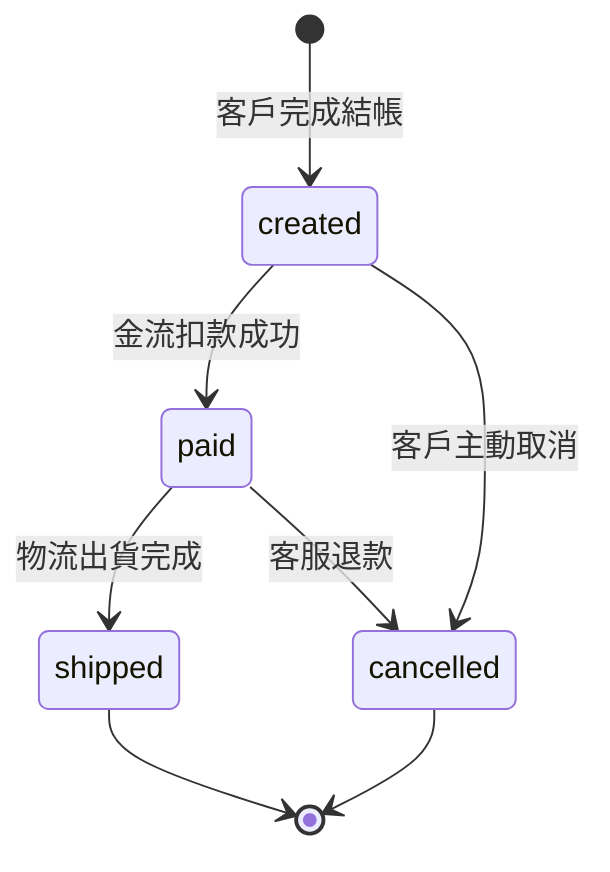

# 訂單生命週期

## 業務規則

訂單成立後依「建立 → 付款 → 出貨」推進，任一階段都可能被取消。
取消**不刪除資料**，以 `cancelled_at` 記錄時間，`status` 同時改為
`cancelled`——兩者由結帳服務在同一筆交易寫入，保證一致。

`shipped` 與 `cancelled` 是終態：進入終態後訂單內容不再變動，
下游可安全視為最終結果。

## 狀態機

## 這對資料設計的意義

- `status` 的值域就是上圖的四個狀態；多出來或少掉都代表設計與業務脫節
- 每個轉移若需要追溯時間，就要有對應的時間欄（目前只有 `cancelled_at`
  被顯性記錄，其餘轉移時間依賴 `updated_at`）
- 終態可用來判斷「這行還會不會變」，影響下游快取與增量抽取策略
