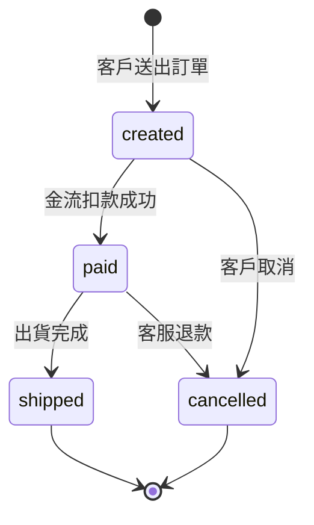

# business/ — 業務素材（萬用夾）

放**任何幫助理解業務的東西**：文字描述、狀態機、時序圖、使用者旅程、
規則說明⋯⋯。這個資料夾刻意不規定結構——**給了什麼都會被當成參考素材**，
一律進設計 prompt 與顧問區，供 agent 判讀「設計與治理是否符合業務邏輯」。

與其他資料夾的分工：

| 資料夾 | 放什麼 | 引擎怎麼用 |
|---|---|---|
| `erd/` | 領域參考 ER 模型 | **結構解析**：實體、關係、欄位定義會進閘門比對 |
| `flows/` | E2E 資料流程（flowchart） | **結構解析**：站點與上下游會標註在報告 |
| `business/` | 其他所有業務知識 | **不解析結構**，整份當文字素材給 LLM 判讀 |

換句話說：`erd/` 與 `flows/` 格式不對會被檢查提醒；`business/` 不會——
它的價值在內容，不在格式。

---

## 檔案規則

- 任意檔名的 `.md`（`README*` 會跳過），一個主題一個檔
- 建議第一行寫 `# 標題`（沒寫的話 `run.py` 會用檔名自動補）
- mermaid 圖放 ` ```mermaid ` fence 內（忘了包 fence 也沒關係，
  `run.py` 起跑時會自動幫你包，GitHub／VS Code 才渲染得出來）
- **圖的種類不限**：`stateDiagram`、`sequenceDiagram`、`journey`、
  `flowchart`、`classDiagram`⋯⋯認不出來的種類照樣載入，只是摘要少一個標籤
- 文字與圖可以混排，一個檔可以放多張圖

---

## Template（複製這份骨架）

````markdown
---
index_summary: 一句話說明這份素材（不填就用 🤖 自動摘要）
index_stage: [L, P]     # L＝logical 起草要看；P＝physical/DDL 才要看
index_required: false   # true＝必讀，設計出處漏引用會被提醒
---

# 訂單生命週期

## 業務規則

一段白話：這件事在業務上怎麼運作、誰在什麼時候會改變什麼。
狀態值的定義、允許的轉移、不允許的轉移，都寫在這裡。

## 狀態機



## 這對資料設計的意義

（建議寫）狀態欄應涵蓋哪些值、哪些轉移需要留時間戳、
哪些狀態是終態（可用來判斷資料是否還會變動）。
````

---

## 怎麼被使用

| 模式 | 怎麼進來 | 拿來做什麼 |
|---|---|---|
| 🎨 design | 進素材索引（標階段／必讀），agent 按需開檔 | 起草時對齊業務規則：狀態值、事件順序、生命週期 |
| 🛡 govern | 顧問 prompt 的「業務素材」區塊列出目錄 | 判讀設計是否與業務描述一致，不一致以提問形式指出 |

一律是**參考與建議**：業務素材永遠不會直接卡合規判定
（閘門只跑確定性規則），但它會讓顧問區的提問精準很多。
