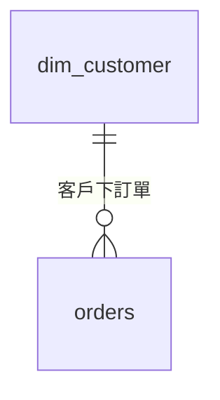

# domain 參考 ER 模型（Markdown ＋ ```mermaid）

放本領域「核心實體與關係」的參考模型。標準格式是 **Markdown**：
`erd/*.md`，圖放 ```mermaid fence 內、fence 外可寫說明文字（引擎只解析
fence）；GitHub / VS Code 直接渲染成圖。舊式純 `.mmd` 仍相容。

````markdown
# ○○ 領域核心參考模型
說明文字（不影響解析）。


````

驗證 DDL 時，凡「兩端表都出現在本次 DDL」的關係會被納入比對
（LINEAGE.ER_SUGGESTION），提示宣告與模型的出入。

## tables/ — 參考表用途（reference tables）

`erd/tables/<表名>.md`（**檔名＝表名**）記載參考模型中每張表的用途。
input 新產生的表對得上參考表時：

- 報告顧問區出 `ERD.TABLE_PURPOSE`，把文件記載的用途帶進報告對照
- 顧問區 LLM 會判讀「本次設計是否正確 reference」——粒度／欄位／關聯
  偏離記載用途時以提問形式指出（進迭代問答迴圈）

```markdown
# orders
訂單頭事實表。一列代表一張已成立的訂單…（自由撰寫，開頭標題行可省略）
```
