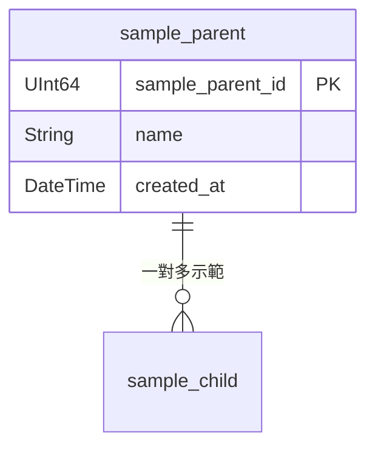

# 範例：參考模型寫法（示範用假想表，不會影響任何驗證）

fence 外可以寫說明文字，引擎只解析 ```mermaid 區塊。
entity 區塊可定義欄位（含 PK 標記）——對得上本次 DDL 的表時，
引擎會做**確定性欄位對照**（ERD.ENTITY_REFERENCE）：參考模型定義的
欄位缺漏、或標 PK 的欄位未列入鍵，閘門區出警告。


```mermaid
erDiagram
    sample_parent ||--o{ sample_child : "一對多示範"
    sample_parent {
        UInt64 sample_parent_id PK
        String name
        DateTime created_at
    }
```
