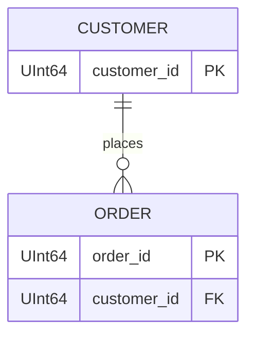

# ER diagrams（引擎內部個案 fixtures）

這裡存放**引擎內部測試個案**的 Mermaid ER diagram。檔名與個案同名時自動載入：

```text
config/_engine/cases/07_er_diagram_suggestion.yaml
config/_engine/er_diagrams/07_er_diagram_suggestion.mmd
```

> 正式的 domain ER 參考模型請放 `config/<域>/erd/*.md`（標準格式 .md 內含
> mermaid fence；舊式 `.mmd` 相容），並可在 `erd/tables/<表名>.md` 記載表用途。

支援 `.mmd`、`.mermaid`、`.md`，內容使用 Mermaid `erDiagram`：



ER 關係只代表結構關聯，不等於 runtime data flow。因此工具會把它轉成 lineage
顧問建議；若要進確定性閘門，仍需在 `input/<名>/relations.yaml` 明確宣告
方向與基數（legacy 集中式個案則寫在 `config/_engine/cases/<名>.yaml` 的
`lineage`）。
