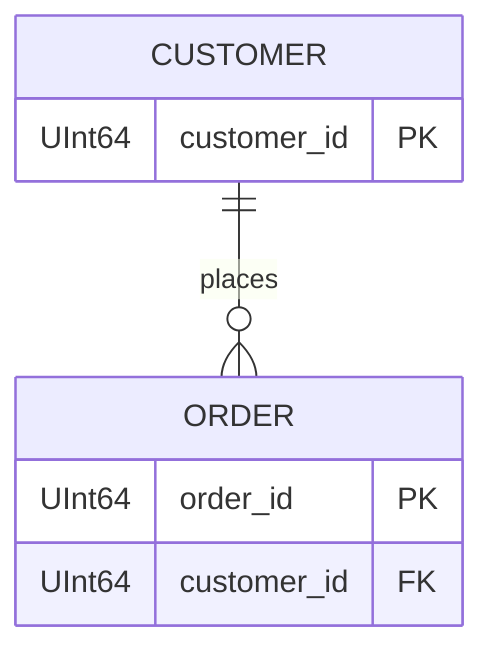

# ER diagrams

這裡存放 Mermaid ER diagram。檔名與待驗證 DDL 同名時會自動載入：

```text
input/order.sql
config/er_diagrams/order.mmd
```

支援 `.mmd`、`.mermaid`、`.md`，內容使用 Mermaid `erDiagram`：



ER 關係只代表結構關聯，不等於 runtime data flow。因此工具會把它轉成 lineage
顧問建議；若要進確定性閘門，仍需在 `config/cases/<DDL名>.yaml` 的 `lineage`
明確宣告方向與欄位映射。
