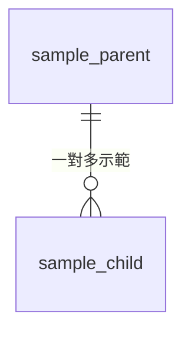
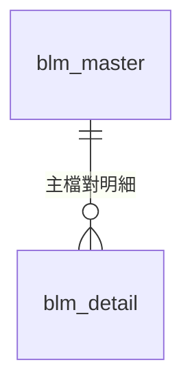
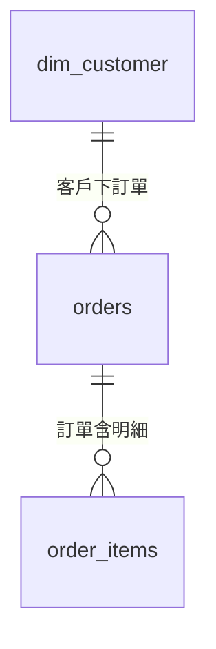
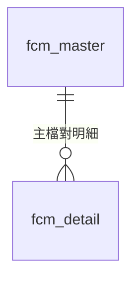
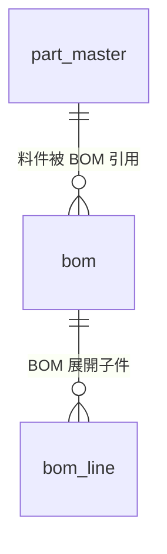
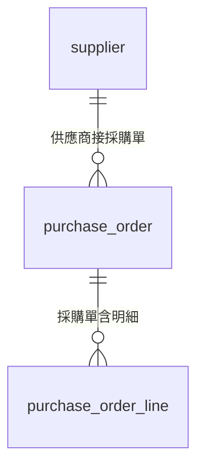
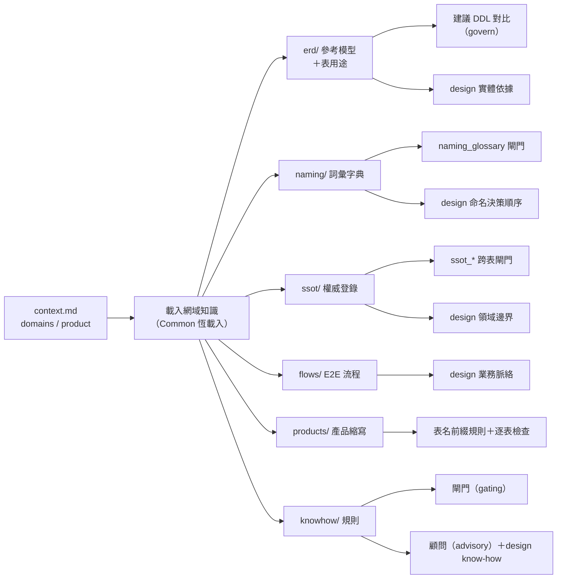

# config 知識庫總索引（自動產生）

> 重新產生：`python config_index.py`——新增或修改 config 文件後隨時重跑；內容確定性，config 沒變重跑結果相同。

規則逐條明細另見 `docs/規則索引.generated.md`（由 `python rules.py check` 產生）。

## 1. 網域（Product Suite）總覽

| 網域 | ER 實體 | 詞彙字典 | SSOT 權威 | 產品 | 閘門規則 | 顧問規則 |
|---|---|---|---|---|---|---|
| **Common** | `sample_child`、`sample_parent` | 有 | `customer`、`product` | — | 23 | 3 |
| **BLM** | `blm_detail`、`blm_master` | 有 | — | — | 1 | 0 |
| **CRM** | `dim_customer`、`order_items`、`orders` | 有 | — | `om`、`pi` | 1 | 0 |
| **FCM** | `fcm_detail`、`fcm_master` | 有 | — | — | 1 | 1 |
| **PLM** | `bom`、`bom_line`、`part_master` | 有 | — | — | 2 | 4 |
| **SCM** | `purchase_order`、`purchase_order_line`、`supplier` | 有 | — | — | 3 | 1 |

## 2. 素材清單（全部檔案；🤖＝自動摘要待人工確認）

| 素材 | 路徑 | 摘要 | 階段 | 必讀 | 狀態 |
|---|---|---|---|---|---|
| 參考 ER 模型 | `config/Common/erd/_sample.md` | 實體：sample_child、sample_parent | L | — | 🤖 |
| 詞彙字典 | `config/Common/naming/glossary.md` | 禁用 9、別名 6、白名單未啟用 | P | — | 🤖 |
| SSOT 權威登錄 | `config/Common/ssot/registry.yaml` | 權威登錄：customer、product | L,P | ✅ | 🤖 |
| 產品縮寫註冊表 | `config/Common/products/registry.md` | （尚無產品，含分層前綴定義） | P | — | 🤖 |
| 參考 ER 模型 | `config/BLM/erd/blm_core.md` | 實體：blm_detail、blm_master | L | — | 🤖 |
| 詞彙字典 | `config/BLM/naming/glossary.md` | 禁用 0、別名 0、白名單未啟用 | P | — | 🤖 |
| SSOT 權威登錄 | `config/BLM/ssot/registry.yaml` | （空登錄） | L,P | ✅ | 🤖 |
| 參考 ER 模型 | `config/CRM/erd/crm_core.md` | 實體：dim_customer、order_items、orders | L | — | 🤖 |
| 參考表用途 | `config/CRM/erd/tables/dim_customer.md` | 客戶主檔維度表。一列代表一位客戶，客戶屬性（名稱、分級、聯絡方式）的 | L | — | 🤖 |
| 參考表用途 | `config/CRM/erd/tables/order_items.md` | 訂單明細事實表。一列代表訂單內的一個品項（訂單 × 商品粒度）， | L | — | 🤖 |
| 參考表用途 | `config/CRM/erd/tables/orders.md` | 訂單頭事實表。一列代表一張已成立的訂單，承載訂單層級的業務事實 | L | — | 🤖 |
| 詞彙字典 | `config/CRM/naming/glossary.md` | 禁用 0、別名 0、白名單未啟用 | P | — | 🤖 |
| E2E 業務流程 | `config/CRM/flows/order_to_revenue.md` | 結帳服務寫入訂單，展開明細，匯總成營收報表。 | L | — | 🤖 |
| SSOT 權威登錄 | `config/CRM/ssot/registry.yaml` | （空登錄） | L,P | ✅ | 🤖 |
| 產品縮寫註冊表 | `config/CRM/products/registry.md` | 產品：pi、om | P | — | 🤖 |
| 參考 ER 模型 | `config/FCM/erd/fcm_core.md` | 實體：fcm_detail、fcm_master | L | — | 🤖 |
| 詞彙字典 | `config/FCM/naming/glossary.md` | 禁用 0、別名 0、白名單未啟用 | P | — | 🤖 |
| SSOT 權威登錄 | `config/FCM/ssot/registry.yaml` | （空登錄） | L,P | ✅ | 🤖 |
| 參考 ER 模型 | `config/PLM/erd/plm_core.md` | 實體：bom、bom_line、part_master | L | — | 🤖 |
| 詞彙字典 | `config/PLM/naming/glossary.md` | 禁用 0、別名 0、白名單未啟用 | P | — | 🤖 |
| E2E 業務流程 | `config/PLM/flows/eco_to_bom.md` | 變更單核准後更新料件版次並展開至 BOM。（範例，依實際流程替換） | L | — | 🤖 |
| SSOT 權威登錄 | `config/PLM/ssot/registry.yaml` | （空登錄） | L,P | ✅ | 🤖 |
| 參考 ER 模型 | `config/SCM/erd/scm_core.md` | 實體：purchase_order、purchase_order_line、supplier | L | — | 🤖 |
| 詞彙字典 | `config/SCM/naming/glossary.md` | 禁用 0、別名 0、白名單未啟用 | P | — | 🤖 |
| E2E 業務流程 | `config/SCM/flows/procure_to_pay.md` | 供應商主檔支撐採購單，採購單對應付款。（範例，依實際流程替換） | L | — | 🤖 |
| SSOT 權威登錄 | `config/SCM/ssot/registry.yaml` | （空登錄） | L,P | ✅ | 🤖 |

## 3. 關聯性

### 3.1 各域 ER 參考模型（實體 × 關係）

**`Common` 的實體關係**

| from | 關係（基數記號） | to | 語意 |
|---|---|---|---|
| `sample_parent` | `\|\|--o{` | `sample_child` | "一對多示範" |

**`BLM` 的實體關係**

| from | 關係（基數記號） | to | 語意 |
|---|---|---|---|
| `blm_master` | `\|\|--o{` | `blm_detail` | "主檔對明細" |

**`CRM` 的實體關係**

| from | 關係（基數記號） | to | 語意 |
|---|---|---|---|
| `dim_customer` | `\|\|--o{` | `orders` | "客戶下訂單" |
| `orders` | `\|\|--o{` | `order_items` | "訂單含明細" |

**`FCM` 的實體關係**

| from | 關係（基數記號） | to | 語意 |
|---|---|---|---|
| `fcm_master` | `\|\|--o{` | `fcm_detail` | "主檔對明細" |

**`PLM` 的實體關係**

| from | 關係（基數記號） | to | 語意 |
|---|---|---|---|
| `bom` | `\|\|--o{` | `bom_line` | "BOM 展開子件" |
| `part_master` | `\|\|--o{` | `bom` | "料件被 BOM 引用" |

**`SCM` 的實體關係**

| from | 關係（基數記號） | to | 語意 |
|---|---|---|---|
| `purchase_order` | `\|\|--o{` | `purchase_order_line` | "採購單含明細" |
| `supplier` | `\|\|--o{` | `purchase_order` | "供應商接採購單" |

### 3.2 SSOT 權威對照（同一事實誰是唯一權威）

| 網域 | 實體 | 權威表 | 鍵 |
|---|---|---|---|
| Common | `customer` | `dim_customer` | `customer_id` |
| Common | `product` | `dim_product` | `product_id` |

### 3.3 知識如何互相支撐（機制關聯）

- `context.md` 的 `domains` 決定載入哪些網域知識（Common 恆載入）、`product` 決定表名前綴
- `erd/`（參考模型）→ 建議 DDL 組建、design 起草的實體依據；`erd/tables/` → 表用途對照（ERD.TABLE_PURPOSE）
- `naming/`（詞彙字典）→ `naming_glossary` 閘門實檢＋design 命名決策順序第 1 級
- `ssot/`（權威登錄）→ `ssot_*` 跨表閘門規則＋design 領域邊界依據
- `flows/`（E2E 流程）→ design 業務脈絡素材
- `products/`（產品縮寫）→ 表名 `<分層>_<縮寫>_` 前綴規則與逐表檢查
- `knowhow/`（規則）→ 閘門（gating）與顧問（advisory）；design 以「設計約束」「設計 know-how」緊湊清單參照

## 4. 標記（Tag）一覽

| 標記 | 出現在 | 意義 |
|---|---|---|
| `L` | 素材索引「階段」 | logical 起草（業務世界）時要讀 |
| `P` | 素材索引「階段」 | physical／DDL 落地時才要讀 |
| `✅ 必讀` | 素材索引 | 設計必須讀並列入 narrative.references，漏了 design_story 會提醒 |
| `🤖` | 索引狀態 | 摘要為自動萃取，待人工以 front-matter 確認 |
| `✍️` | 索引狀態 | 已人工維護（檔案 front-matter 有 index_* 欄位）|
| `index_summary / index_stage / index_required` | 素材檔 front-matter | 索引三欄位（皆選填），維護方式見 reports/design_index_review.md 表頭 |
| `blocking / warning` | 閘門規則 enforcement | 會擋／只警告 |
| `gating / advisory` | 規則 zone | 閘門（確定性、影響判定）／顧問（建議、永不影響判定）|
| `base / intermediate / wide` | 設計積木層級 | 小積木（源頭表）／中積木（組合表）／寬表 |
| `ods`、`dim`、`dwd`、`dws`、`ads` | 表名分層前綴 | ods＝原始層；dim＝維度表；dwd＝明細事實；dws＝彙總層；ads＝應用層 |
